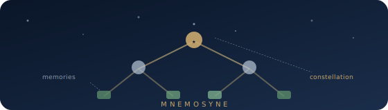
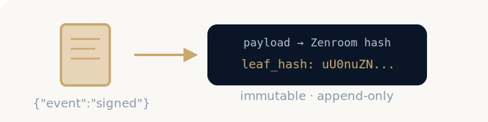
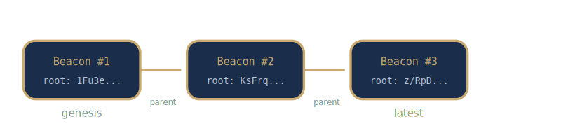
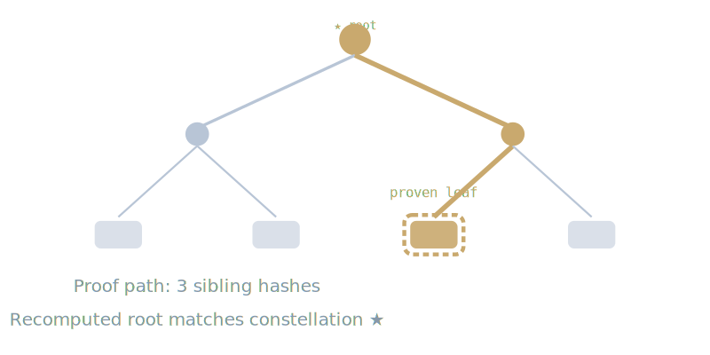
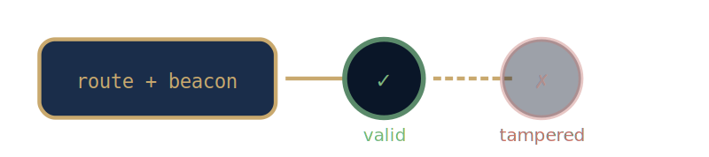
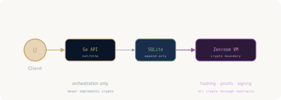

# Mnemosyne

<p align="center">
  <strong>Cryptographic memory archive — verifiable append-only truth</strong><br>
  <sub>Titaness of memory · dyne.org</sub>
</p>

<p align="center">
  
</p>

---

## What is Mnemosyne?

Mnemosyne is an **append-only Merkle tree service** — a transparency log for attestations, events, documents, and workflows. Think of it as a cryptographic notary: once something is archived, it can be **proven** to exist, unchanged, at a specific point in time.

All cryptographic operations are delegated to [**Zenroom**](https://zenroom.org), a deterministic secure language VM. Application code **never** implements hashing, signing, or Merkle proof logic — it only orchestrates.

## Concepts

### Memory — the leaf

A memory is any JSON payload you want to archive. Once stored, it cannot be altered or deleted.

<p align="center">
  
</p>

### Beacon — the checkpoint

A beacon anchors the Merkle tree at a point in time. It stores the **root hash** — the cryptographic fingerprint of all memories in the tree. Each beacon links to its parent, forming an unbroken chain of checkpoints.

<p align="center">
  
</p>

### Route — the proof

A route is a **Merkle inclusion proof** — a cryptographic path from a single leaf up to the constellation root. It proves that a specific memory exists in the tree without revealing any other memories.

<p align="center">
  
</p>

### Witness — the verification

Witness is the act of verifying a route. Zenroom recomputes the Merkle root from the proof path and checks it against the beacon's root. If it matches, the memory is **authentic**. If a single bit is wrong, it fails.

<p align="center">
  
</p>

## Architecture

<p align="center">
  
</p>

**The cryptographic boundary is absolute.** Go code only orchestrates — calling Zenroom for every hash, every Merkle root, every proof, every signature. There is no `sha256.Sum()` anywhere in the codebase.

## Quick start

```bash
# Clone and start
git clone https://github.com/dyne/mnemosyne.git
cd mnemosyne
task run              # starts on :8546

# Or with Docker
task docker:up        # server on :8546
task docker:tunnel    # server + Cloudflare tunnel
```

Open `http://localhost:8546` — you'll see the maritime observatory UI.

## API

| Verb | Path | Concept |
|------|------|---------|
| `POST` | `/memories` | Remember — archive a memory |
| `GET` | `/memories/{id}` | Recall — retrieve a memory |
| `POST` | `/checkpoints` | Anchor — seal a beacon |
| `POST` | `/beacons/{id}/extend` | Extend — add a leaf to a beacon |
| `GET` | `/beacons/{id}` | Inspect — view beacon details |
| `GET` | `/beacons/{id}/memories` | Leaves — list memories in a beacon |
| `GET` | `/proofs/{id}` | Route — generate inclusion proof |
| `POST` | `/verify` | Witness — verify a proof |
| `GET` | `/contracts` | Audit — list Zenroom contracts |
| `GET` | `/contracts/{name}` | Source — read contract source |
| `GET` | `/health` | Pulse — health check |
| `GET` | `/version` | Version — build version |
| `GET` | `/docs` | Reference — Swagger UI |
| `GET` | `/openapi.json` | Spec — OpenAPI 3.0 |

Full interactive documentation at `/docs`.

## Vocabulary

| Technical term | Mnemosyne name | Why |
|----------------|----------------|-----|
| Leaf | **Memory** | Something remembered |
| Merkle root | **Constellation** | A pattern of connected stars |
| Checkpoint | **Beacon** | A signal anchoring time |
| Inclusion proof | **Route** | A verifiable path |
| Verification | **Witness** | Bearing testimony to truth |
| Append | **Remember** | Committing to memory |
| Merkle tree | **Tree of memories** | Rooted in truth |

## Cryptographic contracts

Every cryptographic operation is a **versioned Zenroom contract** in `zenflows/`:

| Contract | Language | Purpose |
|----------|----------|---------|
| `hash.zen` | Zencode | Deterministic SHA256 hashing |
| `merkle_root.zen` | Zencode | Merkle tree root from data array |
| `proof_generate.lua` | Lua | Generate inclusion proof |
| `proof_verify.lua` | Lua | Verify inclusion proof |
| `sign.zen` | Zencode | ECDSA signature generation |

All contracts are auditable at runtime — visit `/contracts` or click **Contracts** in the UI to read the source with syntax highlighting.

## Design

Mnemosyne draws visual inspiration from:

- **Maritime observatories** — brass instruments, nautical charts, starlight navigation
- **Ancient archives** — parchment, sealed records, immutable ledgers
- **Constellations** — branching Merkle paths forming star patterns across the sky

The color palette: deep navy (`#0a1628`), parchment (`#f4e4c1`), brass (`#c9a96e`), starlight silver (`#b8c5d6`), dark slate (`#2d3a4a`).

## Security

- **No crypto in application code** — all hashing, signing, and Merkle operations are delegated to Zenroom VM
- **Append-only** — memories can be created and retrieved; there is no update or delete path
- **Immutability** — once a beacon anchors a tree, its root becomes a permanent cryptographic checkpoint
- **Deterministic builds** — `CGO_ENABLED=0`, pure Go, reproducible binaries
- **Transparent contracts** — all cryptographic logic is in human-readable Zencode/Lua scripts served at `/contracts`
- **SBOM + provenance** — every release includes SPDX SBOM, cosign signatures, and SLSA build attestation

## License

AGPL-3.0 — Dyne.org foundation

<p align="center">
  <sub>Mnemosyne — titaness of memory, mother of the Muses.<br>She who remembers everything. She who can prove it.</sub>
</p>
